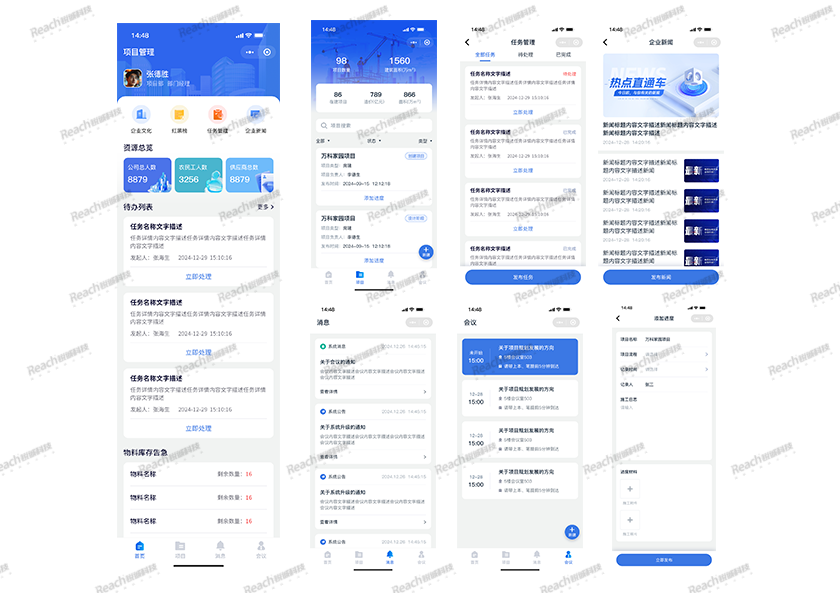
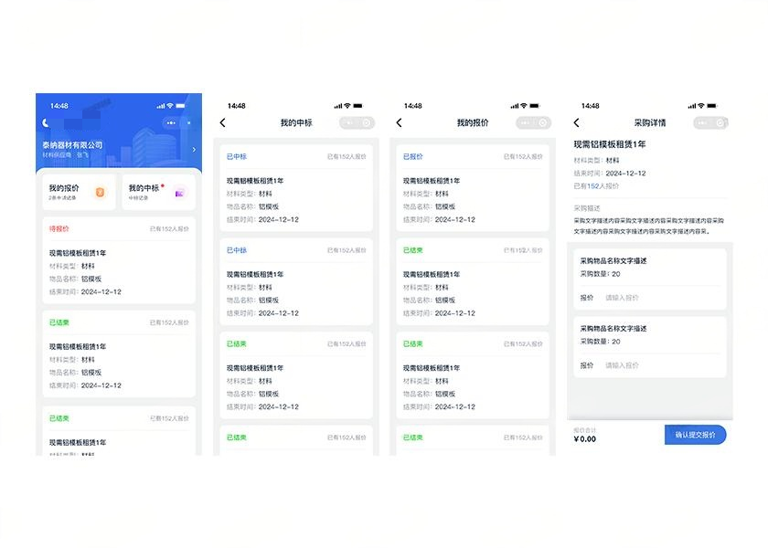

# 🏗️ 工程项目管理ERP系统
> **核心理念**：采用多端协同架构，覆盖PC端、小程序工作端、供应商端、民工端，围绕工程项目全生命周期，实现数据互通、流程闭环、权责清晰，满足企业管理、外部协作、一线民工服务多元需求，该项目由其适合国有城建类型公司，可以完美的适配业务流程。

---

## 📖 项目介绍
本项目是工程建筑行业一体化管理平台，通过四端联动实现项目管控、资金管理、人员协作、文化建设、进销存、民工工资等全流程数字化，提升施工效率、降低管理成本、保障合规安全。

### 1. 核心架构
- **多端协同**：PC管理端 + 移动工作端 + 供应商端 + 民工小程序端
- **全生命周期**：立项 → 施工 → 成本 → 资金 → 人员 → 验收 → 数据分析

### 2. 功能亮点
#### PC 端（核心管控）
- **企业文化**：企业简介、新闻动态、员工红黑榜
- **工程项目管理**：项目信息、负责人、每日施工照片、进度提醒
- **预算与财务**：进度金额填报、预算计划、成本核量、报销、报表、发票
- **进销存/设备**：物资采购、设备管理、出入库跟踪
- **农民工工资**：工资表、发放记录、维权投诉
- **任务管理**：创建、指派、进度跟踪
- **会议管理**：计划、纪要、历史记录
- **数据驾驶舱**：项目/财务可视化
- **系统设置**：权限、角色、操作日志

#### 供应商端
- 认证登录、采购清单查看、在线报价、订单跟踪、消息通知

#### 小程序民工端
- 投诉反馈、历史投诉查询、工资记录实名查看

#### 移动工作端
- 企业文化、项目进度、任务办理、会议提醒、消息实时推送

---

## 🛠 技术栈
### 前端技术
- **PC 管理端**：Vue + Element Plus
- **小程序/移动**：UNIAPP + Vue
- **数据可视化**：ECharts
- **状态管理**：Vuex / Pinia

### 后端技术
- **核心框架**：ThinkPHP 8.0
- **PHP 版本**：PHP >= 8.0.0
- **关系型数据库**：MySQL 5.7+
- **缓存**：File + Redis
- **安全认证**：JWT
- **定时任务**：Crontab
- **负载均衡**：Nginx
- **队列**：Redis + Database
- **日志处理**：Log
- **Excel处理**：PhpSpreadsheet 4.0
- **文件系统**：ThinkPHP Filesystem

---

## 🚀 快速开始
### 环境准备
1. PHP >= 8.0.0
2. MySQL 5.7+
3. Redis 6.0+
4. Node.js v18+

---

## 📢 商务与授权说明
### 本项目遵循 MIT License 开源协议。
1. 授权范围
允许个人或企业在非商业项目中自由使用、修改和分发本代码。
允许用于学习、教学及原型开发。
2. 限制与免责
商标保留：相关Logo商标归原作者所有，未经许可不得用于商业推广。
免责声明：本软件按“原样”提供，不提供任何形式的担保。作者不对因使用本软件造成的任何直接或间接损失负责。
隐私合规：使用本项目涉及用户隐私数据时，使用者需自行确保符合《个人信息保护法》等相关法律法规要求。
3. 商业合作
如需获取完整源码、定制开发或企业级部署支持，请联系：
邮箱：sxq@reachyou.cn

### 代码以及系统试用体验咨询：

## 📸 截图预览

